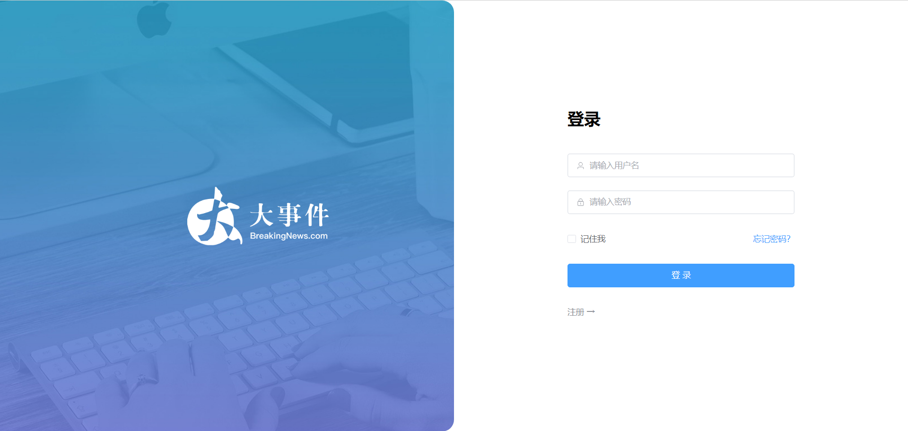
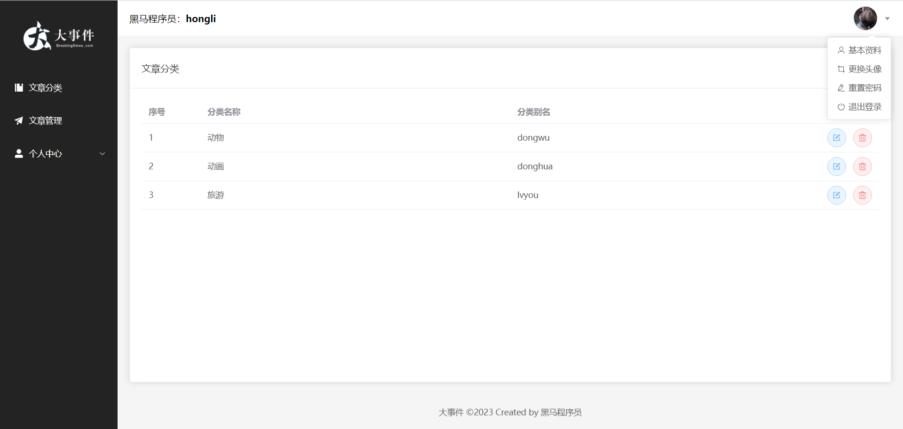
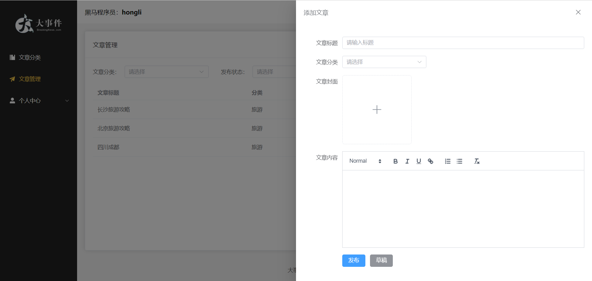

# 项目介绍
黑马大事件(SpringBoot3 + Vue3), B站教学视频(https://www.bilibili.com/video/BV14z4y1N7pg/?spm_id_from=333.337.search-card.all.click)
# 软件架构
后端：springboot+maven+mybatis+mysql+redis+lombok+validation+JWT+pageHelper+Ali OSS

前端：vue3+vue-router+axios+element-plus+pinia
# 项目组成
* 前端：bit-event-vue
* 后端：bit-event-java
# 后端接口文档
https://www.showdoc.com.cn/escook/3707372986195375
# 实现功能
* 用户管理模块：用户登录、用户注册、用户信息修改、用户头像上传、用户密码修改。
* 文章分类模块：编辑分类、删除分类、查询分类。
* 文章管理模块：编辑文章、删除文章、查询文章。
# 个人点评
* 在登录注册时，使用JWT生成token，并保存到redis中，在每次请求时，在请求头中携带token，在拦截器中验证token是否有效，如果token无效，则返回401状态码，提示“token无效”。
* 利用 @Validated 注解进行数据校验。
* 使用 @RestControllerAdvice 注解统一处理全局异常。
# 安装说明
1. 运行项目前，请先安装好mysql和redis
2. 运行项目前，请先修改application.yaml中的数据库和redis配置
# 项目截图

